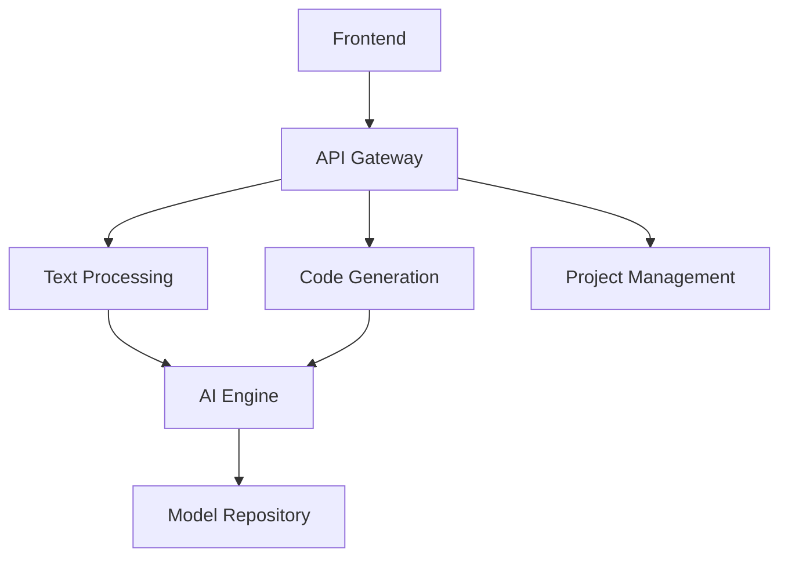

# Dialogware - Dokumentacja

## Spis treści

1. [Wprowadzenie](#wprowadzenie)
2. [Architektura systemu](#architektura-systemu)
3. [Komponenty podstawowe](#komponenty-podstawowe)
4. [Rozwój i integracje](#rozwój-i-integracje)
5. [Program partnerski](#program-partnerski)
6. [Bezpieczeństwo i zgodność](#bezpieczeństwo-i-zgodność)
7. [API Reference](#api-reference)
8. [FAQ](#faq)

## Wprowadzenie

### O Dialogware

Dialogware to kompleksowa platforma do automatyzacji tworzenia i wdrażania oprogramowania z wykorzystaniem sztucznej inteligencji. System pozwala na generowanie kodu źródłowego z opisów tekstowych, zarządzanie projektami oraz integrację z popularnymi narzędziami deweloperskimi.

### Główne funkcje

1. **Text-to-Software**
    - Generacja kodu z opisów tekstowych
    - Wsparcie wielu języków programowania
    - Inteligentne sugestie i optymalizacje
    - Automatyczna dokumentacja

2. **AI Assistant**
    - Pomoc w projektowaniu architektury
    - Sugestie optymalizacji kodu
    - Analiza bezpieczeństwa
    - Code review

3. **Integracje**
    - Systemy kontroli wersji (Git)
    - CI/CD pipelines
    - Cloud providers
    - IDE plugins

## Architektura systemu

### Komponenty systemowe



### Warstwy systemu

1. **Presentation Layer**
    - Web Interface
    - IDE Plugins
    - CLI Tool
    - REST API

2. **Business Logic Layer**
    - Text Analysis
    - Code Generation
    - Project Management
    - Security

3. **Data Layer**
    - Model Storage
    - User Data
    - Projects
    - Analytics

### Wymagania systemowe

```bash
# Minimalne wymagania
CPU: 4 cores
RAM: 8GB
Storage: 50GB
OS: Ubuntu 20.04+/Windows 10+/macOS 11+

# Rekomendowane
CPU: 8+ cores
RAM: 16GB+
Storage: 100GB+ SSD
Network: 100Mbps+
```

## Komponenty podstawowe

### Text Processing Engine

```typescript
interface TextProcessingConfig {
  language: string;
  framework?: string;
  architecture?: string;
  optimizationLevel: 'basic' | 'advanced';
}

class TextProcessor {
  async analyze(input: string, config: TextProcessingConfig): Promise<AnalysisResult> {
    // Implementation
  }
}
```

### Code Generation

```typescript
interface CodeGenConfig {
  language: ProgrammingLanguage;
  style: CodingStyle;
  patterns: DesignPattern[];
  testing: boolean;
}

class CodeGenerator {
  async generate(spec: ProjectSpec, config: CodeGenConfig): Promise<GeneratedCode> {
    // Implementation
  }
}
```

### Project Management

```typescript
interface Project {
  id: string;
  name: string;
  description: string;
  settings: ProjectSettings;
  components: Component[];
  integrations: Integration[];
}

class ProjectManager {
  async createProject(spec: ProjectSpec): Promise<Project> {
    // Implementation
  }
}
```

## Rozwój i integracje

### SDK Implementation

```typescript
import { Dialogware } from '@dialogware/sdk';

const dw = new Dialogware({
  apiKey: 'your-api-key',
  environment: 'production'
});

// Project creation
const project = await dw.createProject({
  name: 'My App',
  description: 'A web application',
  settings: {
    language: 'typescript',
    framework: 'react'
  }
});

// Code generation
const code = await dw.generateCode({
  description: 'Create a user authentication system',
  options: {
    includeTests: true,
    style: 'functional'
  }
});
```

### CI/CD Integration

```yaml
# .dialogware/pipeline.yml
version: '1.0'
pipeline:
  stages:
    - name: analyze
      steps:
        - text-processing
        - architecture-validation
    
    - name: generate
      steps:
        - code-generation
        - tests-generation
        - docs-generation
    
    - name: validate
      steps:
        - code-review
        - security-check
        - performance-analysis
```

### Plugin Development

```typescript
interface DialogwarePlugin {
  name: string;
  version: string;
  hooks: {
    beforeAnalysis?: (input: string) => Promise<string>;
    afterGeneration?: (code: GeneratedCode) => Promise<GeneratedCode>;
    onError?: (error: Error) => void;
  };
}

class CustomPlugin implements DialogwarePlugin {
  name = 'custom-plugin';
  version = '1.0.0';
  
  hooks = {
    beforeAnalysis: async (input) => {
      // Custom preprocessing
      return input;
    }
  };
}
```

## Program partnerski

### Poziomy partnerskie

1. **Silver Partner**
    - 20% prowizji
    - Podstawowe wsparcie
    - Dostęp do portalu
    - Materiały marketingowe

2. **Gold Partner**
    - 25% prowizji
    - Priorytetowe wsparcie
    - Szkolenia online
    - Co-marketing

3. **Platinum Partner**
    - 30% prowizji
    - Dedykowany opiekun
    - Custom development
    - Strategic planning

### System afiliacyjny

```typescript
interface AffiliateConfig {
  partner: Partner;
  commission: {
    percentage: number;
    type: 'revenue' | 'profit';
    tiers: CommissionTier[];
  };
  tracking: {
    cookieDuration: number;
    customParameters: string[];
  };
}

class AffiliateSystem {
  async track(referral: ReferralData): Promise<void> {
    // Implementation
  }

  async calculateCommission(sale: Sale): Promise<Commission> {
    // Implementation
  }
}
```

### Integracje CRM

```typescript
interface CRMConfig {
  provider: 'salesforce' | 'hubspot' | 'custom';
  credentials: {
    apiKey: string;
    endpoint: string;
  };
  mapping: {
    fields: FieldMapping[];
    objects: ObjectMapping[];
  };
  sync: {
    frequency: number;
    direction: 'bidirectional' | 'push' | 'pull';
  };
}

class CRMIntegration {
  async sync(): Promise<SyncResult> {
    // Implementation
  }
}
```

## Bezpieczeństwo i zgodność

### Zabezpieczenia

1. **Autentykacja**
   ```typescript
   interface SecurityConfig {
     authentication: {
       type: 'jwt' | 'oauth2';
       providers: AuthProvider[];
       mfa: boolean;
     };
     authorization: {
       roles: Role[];
       permissions: Permission[];
     };
   }
   ```

2. **Szyfrowanie**
   ```typescript
   interface EncryptionConfig {
     algorithm: string;
     keySize: number;
     ivSize: number;
   }
   ```

3. **Audyt**
   ```typescript
   interface AuditEvent {
     timestamp: number;
     user: User;
     action: string;
     resource: string;
     result: 'success' | 'failure';
   }
   ```

### Zgodność

1. **GDPR**
    - Data processing agreements
    - Privacy policy
    - Data retention policies

2. **ISO 27001**
    - Security controls
    - Risk management
    - Incident response

## API Reference

### REST API

```typescript
// Authentication
POST /api/v1/auth/login
POST /api/v1/auth/refresh
POST /api/v1/auth/logout

// Projects
GET /api/v1/projects
POST /api/v1/projects
GET /api/v1/projects/{id}
PUT /api/v1/projects/{id}
DELETE /api/v1/projects/{id}

// Code Generation
POST /api/v1/generate
POST /api/v1/analyze
POST /api/v1/optimize
```

### WebSocket API

```typescript
interface WebSocketMessage {
  type: 'generate' | 'analyze' | 'status';
  payload: any;
}

// Connection
ws://api.dialogware.com/v1/realtime

// Events
socket.on('progress', (data: ProgressData) => {
  // Handle progress updates
});

socket.on('completion', (data: CompletionData) => {
  // Handle completion
});
```

### GraphQL API

```graphql
type Project {
  id: ID!
  name: String!
  description: String
  components: [Component!]!
  settings: ProjectSettings!
}

type Query {
  projects: [Project!]!
  project(id: ID!): Project
}

type Mutation {
  createProject(input: ProjectInput!): Project!
  generateCode(input: GenerateInput!): GeneratedCode!
}
```

## FAQ

### Ogólne pytania

Q: Jak zacząć korzystanie z Dialogware?
A: Rozpocznij od utworzenia konta i pobrania SDK. Nasza dokumentacja zawiera przykłady i tutoriale.

Q: Jakie języki programowania są wspierane?
A: Wspieramy większość popularnych języków, w tym:
- JavaScript/TypeScript
- Python
- Java
- C#
- Go
- PHP

Q: Czy mogę używać własnych modeli AI?
A: Tak, platforma pozwala na integrację własnych modeli poprzez API.

### Techniczne pytania

Q: Jak działa generacja kodu?
A: System wykorzystuje zaawansowane modele AI do:
1. Analizy wymagań
2. Projektowania architektury
3. Generacji kodu
4. Optymalizacji i testowania

Q: Jakie są limity API?
A: Limity zależą od wybranego planu:
- Pro: 1000 requestów/h
- Enterprise: Bez limitu

[Koniec dokumentacji]
